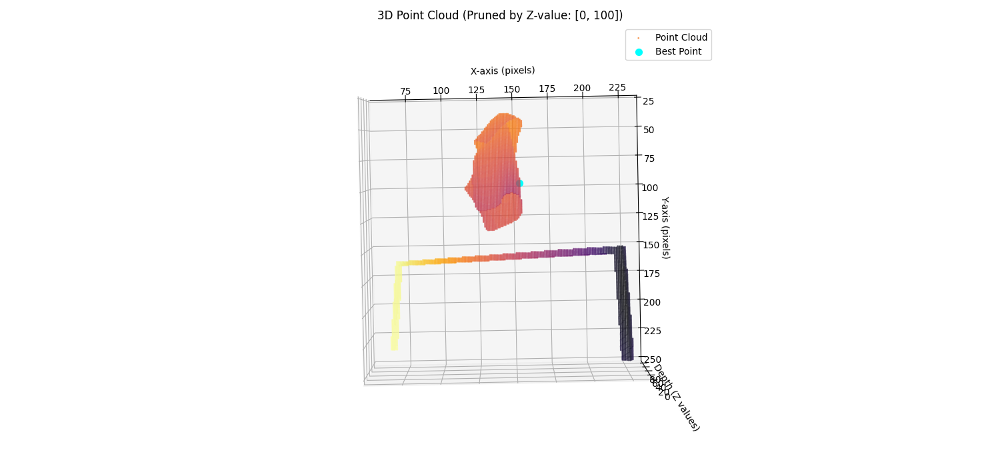
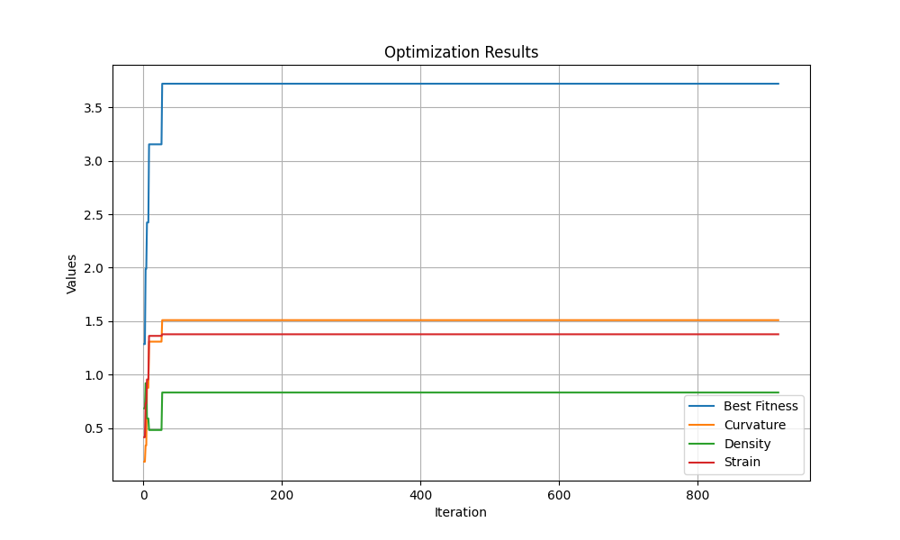

# Cloth Grasping Optimization using Simulated Annealing
This repository contains a solution for detecting an optimal grasping point on a cloth using a simulated annealing optimization technique. The project processes depth data, generates a point cloud, and utilizes a custom objective function that incorporates curvature, density, and strain to identify the best grasping points for robotic manipulation.

Table of Contents
1. [Installation](#installation)
2. [Running the Program](#running-the-program)
3. [Prevalent Methods for Grasping Detection](#prevalent-methods-for-grasping-detection)
4. [References](#references)

## Installation

1. Clone this repository to your local machine.

```bash
git clone https://github.com/exMachina316/cloth_grasp_siman.git
```

2. Ensure [Docker](https://docs.docker.com/engine/install/) is installed and running on your system.

3. Build the docker image
```bash
cd cloth_grasp_siman 
docker build -t cloth-recon-dev .
```

4. Start the Docker container:
```bash
cd docker_scripts
./run_devel.sh
```

4. Access the development environment:

```bash
./enter.sh
```

## Running the Program

Once the environment is set up and dependencies are installed, you can run the program as follows:

1. Navigate to the src directory:

```bash
cd /app/workspace/src
```

2. Run the grasp point calculation script:

```bash
python3 grasp_point_calculator.py
```
This will load the depth data, generate the point cloud, and run the simulated annealing optimization. The output will show log messages detailing the optimization process, including the temperature and fitness metrics at each iteration. After optimisation is complete, the optimal grasping point is displayed on the cloth point cloud.



3. View the optimisation function metrics (Optional)

```bash
python3 plot_optimization_results.py
```



## Prevalent Methods for Grasping Detection

1. Geometric Methods:

These methods involve analyzing the geometry of the object to detect grasping points. For cloth, curvature and point density are important metrics, as they can help identify stable regions with minimal deformation. Examples include edge detection algorithms and curvature-based methods.

2. Learning-based Approaches:

Machine learning models, such as deep neural networks, are increasingly used for predicting optimal grasping points. These methods are trained on labeled data, allowing the model to learn complex patterns and directly predict stable grasp points.

3. Physics-based Simulations:

Some methods use simulations to model the interaction between the robot and the cloth. These simulations consider factors such as cloth stiffness, friction, and material properties to predict the best grasp points that minimize slippage and deformation.

4. Hybrid Approaches:

Hybrid methods combine the strengths of both geometric and learning-based approaches. For example, geometric methods may be used to narrow down potential grasp points, which are then refined by machine learning models.

5. Optimization Algorithms:

Optimization techniques, like the simulated annealing approach used in this project, are also applied to search for optimal grasp points based on predefined criteria such as curvature, density, and strain. These algorithms iteratively adjust the grasp point until an optimal solution is found.

## References
- A. Bicchi, "Robotic Grasping and Manipulation," IEEE Robotics and Automation Magazine, vol. 17, no. 4, pp. 73–82, Dec. 2010.
- R. B. Rusu, N. Blodow, and M. Beetz, "Fast Point Feature Histograms (FPFH) for 3D Registration," IEEE International Conference on Robotics and Automation (ICRA), pp. 3212–3217, 2009.
- D. Berenson, S. Srinivasa, D. Ferguson, and J. K. T. A. and A. Rodriguez, "Manipulation Planning on Manifold," IEEE International Conference on Robotics and Automation (ICRA), 2015.